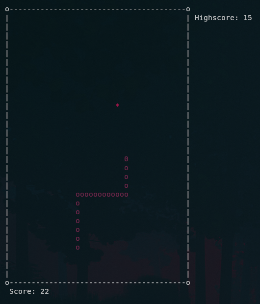

# terminal-snake
Snake - the game, written in C++ for Linux only using glibc and the C++ stl


### Controls
```
w, a, s, d - Change Directions
p - Pause
q - Quit
r - Restart
```

### Installation

1. First Clone or download this repository

1. Compile

`make install` Compiles and installs by default to ~/.local/bin and ~/.snake/highscore.txt.
This can be changed in the makefile, or be done manually by just running `make`.
This will only generate the executable in the ./bin directory.
Highscore file will be generated in whatever directory you are in when you run the game.

`make uninstall` This will remove the executable from .local/bin and delete .snake directory.
